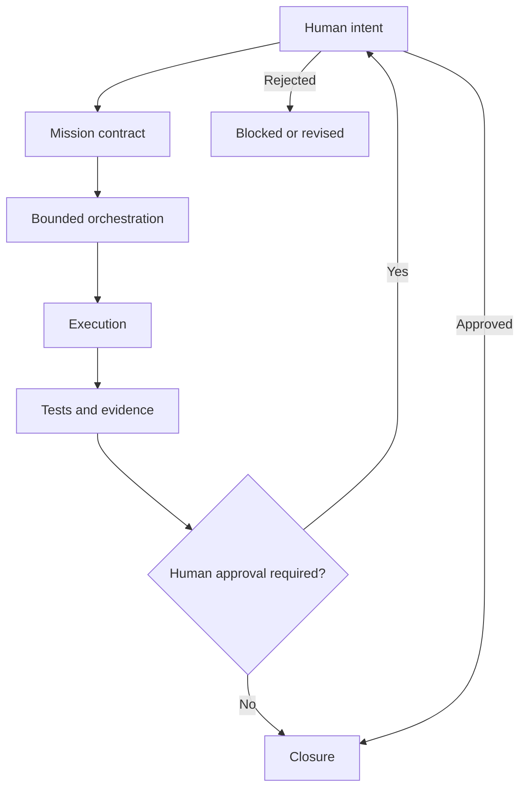
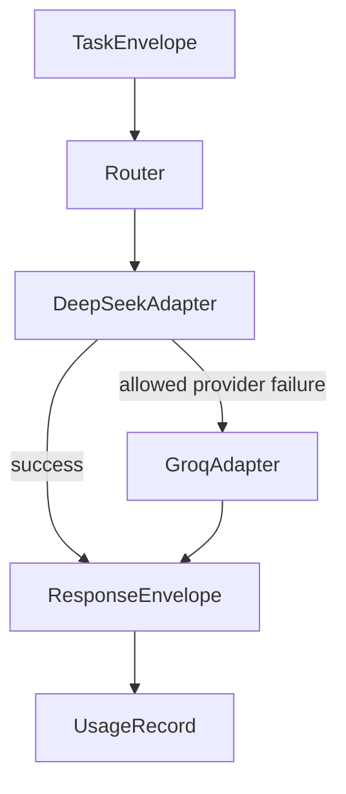

# KIANGANA 2.0 Architecture

This document separates the **current main architecture** from the **verified historical KIF checkpoint**.

## 1. Current main — governance and evidence foundation

### Current-main boundaries

- Human authority remains final.
- Permissions are defined through internal governance artifacts.
- Validation compares outputs against explicit acceptance criteria.
- Secrets must not be committed.
- Sensitive external actions remain prohibited by default.
- The current root Gate Zero workflow validates this repository surface only.

Current main evidence: Actions run `35324662670` — **SUCCESS**.

## 2. KIF — verified historical execution layer

KIF is a KIANGANA 2.0 module, but its V0.2 source is **not present on current `main`**. The verified checkpoint is preserved at freeze commit:

`57c4bfc2664398383a784128a9fa03dc3e41c0e4`

Architecture at that checkpoint:

### Provider abstraction

`ModelProvider` defines:

- `generate(task)`
- `health()`
- `capabilities()`

The checkpoint contains independent DeepSeek and Groq adapters using `httpx`.

### Controlled fallback

Fallback is deterministic and limited to:

- `TIMEOUT`
- `PROVIDER_DOWN`
- `RATE_LIMIT`
- `QUOTA_EXHAUSTED`

No fallback occurs for:

- `AUTH_ERROR`
- `INVALID_REQUEST`

### Response and usage

`ResponseEnvelope` records:

- task ID;
- provider;
- model;
- output;
- status;
- token usage;
- latency;
- optional estimated/actual cost fields.

`UsageStore` persists `UsageRecord` entries as append-only JSONL.

Observed in the live proof:

- Groq input tokens: 78
- Groq output tokens: 62
- Groq total tokens: 140
- persisted provider: `groq`

Actual monetary cost was not observed and remained `None`.

## 3. Verification surfaces are separate

Two CI surfaces must not be conflated:

1. **Current main Gate Zero** — governance/evidence validation on `main`.
2. **Historical KIF V0.2 workflow** — provider, fallback, usage and KIF-specific tests on `kif-v0.2-cp01`.

The historical repository-level Gate Zero run `35287044647` failed at the KIF freeze head because the root scanner detected a prohibited credential marker in KIF-tracked files. The current main run `35324662670` later passed because those KIF files are absent from the current main tree.

## 4. Non-claims

This architecture does not establish:

- autonomous agents;
- memory or vector search;
- a public API;
- a UI;
- a production deployment;
- actual monetary cost accounting;
- external security certification.

Those remain outside the demonstrated state.
